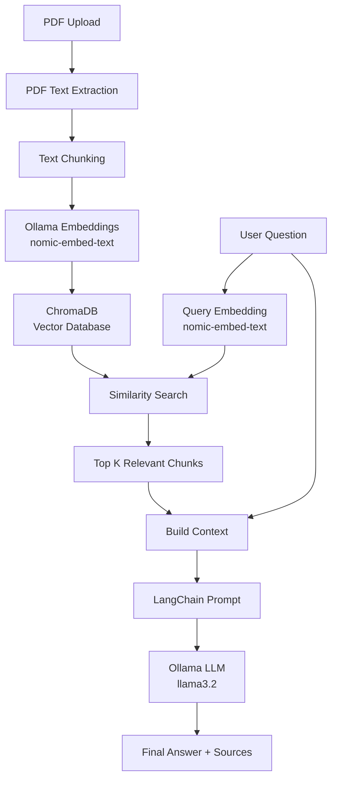

# PDF RAG Chatbot

A backend application for **chatting with PDF documents using Retrieval-Augmented Generation (RAG)**.

The application allows a user to upload a PDF, extract and split its text into chunks, generate vector embeddings using a local Ollama embedding model, store those embeddings in ChromaDB, and ask questions about the uploaded document. Relevant chunks are retrieved from ChromaDB and passed to a local LLM through LangChain to generate the final answer.

## Features

- Upload PDF documents
- Extract text from PDFs page by page
- Split extracted text into smaller chunks
- Generate embeddings locally using Ollama
- Store and search embeddings using ChromaDB
- Ask natural-language questions about an uploaded PDF
- Restrict retrieval to a specific uploaded document
- Return page numbers and text snippets as sources
- Local LLM inference using Ollama
- REST APIs built with Node.js, Express, and TypeScript
- Dockerized ChromaDB

## RAG Architecture

The application follows the standard RAG pipeline:



### Indexing / Ingestion Flow

```text
PDF
 ↓
PDF Text Extraction
 ↓
Text Chunking
 ↓
Ollama Embeddings
(nomic-embed-text)
 ↓
ChromaDB
```

### Query / Answering Flow

```text
User Question
 ↓
Question Embedding
 ↓
ChromaDB Similarity Search
 ↓
Top K Relevant Chunks
 ↓
Context + Question
 ↓
LangChain Prompt
 ↓
Ollama / llama3.2
 ↓
Answer + Source Pages/Snippets
```

## Tech Stack

| Technology | Purpose |
|---|---|
| Node.js | Backend runtime |
| TypeScript | Application language |
| Express.js | REST API framework |
| LangChain | RAG orchestration, document handling, text splitting, vector store and LLM integration |
| Ollama | Local AI model runtime |
| llama3.2 | Local chat/LLM model |
| nomic-embed-text | Local embedding model |
| ChromaDB | Vector database |
| Docker | Runs ChromaDB |
| pdf-parse | PDF text extraction |
| Zod | Request/environment validation |
| Multer | PDF upload handling |
| Postman | API testing |

## Project Structure

```text
pdf-rag-chatbot/
│
├── src/
│   ├── config/
│   │   └── env.ts
│   │
│   ├── controllers/
│   │   └── pdf.controller.ts
│   │
│   ├── middleware/
│   │   ├── errorHandler.ts
│   │   └── upload.ts
│   │
│   ├── routes/
│   │   └── index.ts
│   │
│   ├── services/
│   │   ├── ingest.service.ts
│   │   ├── pdf.service.ts
│   │   ├── rag.service.ts
│   │   └── vectorstore.service.ts
│   │
│   ├── types/
│   │
│   ├── utils/
│   │   ├── asyncHandler.ts
│   │   └── httpError.ts
│   │
│   ├── app.ts
│   └── server.ts
│
├── chroma_data/
├── .env
├── .gitignore
├── docker-compose.yml
├── package.json
├── package-lock.json
└── tsconfig.json
```

## How RAG Works in This Project

### 1. Upload a PDF

The client sends a PDF to:

```http
POST /api/pdf/upload
```

Multer receives the file and passes its buffer to the ingestion service.

### 2. Extract text

`pdf.service.ts` uses `pdf-parse` to extract text page by page.

Example:

```text
Page 1 → extracted text
Page 2 → extracted text
Page 3 → extracted text
```

### 3. Split text into chunks

`ingest.service.ts` uses LangChain's `RecursiveCharacterTextSplitter`.

Current configuration:

```env
CHUNK_SIZE=1000
CHUNK_OVERLAP=200
```

The overlap helps preserve context between neighboring chunks.

### 4. Create embeddings

Each chunk is converted into a vector using:

```text
Ollama
└── nomic-embed-text
```

The application uses LangChain's `OllamaEmbeddings` integration.

### 5. Store embeddings in ChromaDB

The vectors and metadata are stored in ChromaDB.

Each chunk contains metadata similar to:

```json
{
  "documentId": "document-uuid",
  "fileName": "example.pdf",
  "page": 1,
  "chunkIndex": 0
}
```

The `documentId` allows the application to search within one uploaded PDF.

### 6. Ask a question

The client sends:

```http
POST /api/chat
```

with:

```json
{
  "documentId": "document-uuid",
  "question": "What is this document about?"
}
```

### 7. Retrieve relevant chunks

The question is embedded using the same embedding model and searched against ChromaDB.

Current configuration:

```env
TOP_K=4
```

This retrieves up to four relevant chunks from the selected document.

### 8. Generate the answer

The retrieved chunks are combined into a context and passed to a LangChain prompt.

The prompt and context are sent to:

```text
Ollama
└── llama3.2
```

The LLM generates an answer based on the retrieved PDF context.

### 9. Return answer and sources

The API returns the generated answer together with page numbers and snippets from the retrieved chunks.

Example:

```json
{
  "answer": "The document is about an enterprise-grade cab booking system...",
  "sources": [
    {
      "page": 1,
      "snippet": "Enterprise Cab Booking Application..."
    },
    {
      "page": 2,
      "snippet": "Database Design..."
    }
  ]
}
```

## Prerequisites

Install the following before running the project:

- Node.js
- Docker Desktop
- Ollama
- Git
- Postman (optional, for API testing)

## Ollama Setup

Install Ollama and make sure it is running.

Pull the models used by this project:

```bash
ollama pull llama3.2
ollama pull nomic-embed-text
```

Verify the models:

```bash
ollama list
```

The application expects Ollama at:

```text
http://localhost:11434
```

## ChromaDB Setup

ChromaDB runs through Docker.

Start ChromaDB:

```bash
docker compose up -d
```

Check the container:

```bash
docker compose ps
```

The application connects to ChromaDB at:

```text
http://localhost:8000
```

Stop ChromaDB:

```bash
docker compose down
```

## Environment Variables

Create a `.env` file in the project root:

```env
PORT=3000

CHROMA_URL=http://localhost:8000
CHROMA_COLLECTION=pdf_chunks_ollama

CHUNK_SIZE=1000
CHUNK_OVERLAP=200

TOP_K=4

CHAT_MODEL=llama3.2
EMBEDDING_MODEL=nomic-embed-text
```

No OpenAI API key is required for the current implementation because both the chat model and embedding model run locally through Ollama.

## Installation

Clone the repository:

```bash
git clone https://github.com/surajmendhe5573/pdf-rag-chatbot.git
cd pdf-rag-chatbot
```

Install dependencies:

```bash
npm install
```

## Run the Application

### 1. Start Ollama

Make sure Ollama is running and the required models are available:

```bash
ollama list
```

### 2. Start ChromaDB

```bash
docker compose up -d
```

### 3. Start the Node.js API

```bash
npm run dev
```

The API will run on:

```text
http://localhost:3000
```

Health check:

```http
GET http://localhost:3000/health
```

Expected response:

```json
{
  "status": "ok"
}
```

## API Endpoints

### Health Check

```http
GET /health
```

Example:

```text
GET http://localhost:3000/health
```

Response:

```json
{
  "status": "ok"
}
```

### Upload PDF

```http
POST /api/pdf/upload
```

Postman:

- Method: `POST`
- URL: `http://localhost:3000/api/pdf/upload`
- Body → `form-data`
- Key: `file`
- Type: `File`
- Select a PDF

Example response:

```json
{
  "documentId": "e4cc8a9d-3902-4379-8d4c-f9d5bf5084d8",
  "fileName": "example.pdf",
  "pages": 2,
  "chunks": 3
}
```

Save the returned `documentId` for the chat request.

### Ask a Question

```http
POST /api/chat
```

Request:

```json
{
  "documentId": "e4cc8a9d-3902-4379-8d4c-f9d5bf5084d8",
  "question": "What is this document about?"
}
```

Example response:

```json
{
  "answer": "This document is about...",
  "sources": [
    {
      "page": 1,
      "snippet": "..."
    },
    {
      "page": 2,
      "snippet": "..."
    }
  ]
}
```

### Delete a PDF

```http
DELETE /api/pdf/:documentId
```

Example:

```text
DELETE http://localhost:3000/api/pdf/e4cc8a9d-3902-4379-8d4c-f9d5bf5084d8
```

Response:

```text
204 No Content
```

## Postman Testing Flow

Use the APIs in this order:

```text
1. GET  /health
       ↓
2. POST /api/pdf/upload
       ↓
3. Copy documentId
       ↓
4. POST /api/chat
       ↓
5. DELETE /api/pdf/:documentId (optional)
```

## Why This Is RAG

RAG stands for:

**Retrieval-Augmented Generation**

This project combines three main stages:

```text
RETRIEVAL
    ↓
Find relevant PDF chunks from ChromaDB

AUGMENTATION
    ↓
Add the retrieved chunks to the LLM prompt

GENERATION
    ↓
LLM generates an answer using the retrieved context
```

Instead of sending the entire PDF directly to the LLM, the application retrieves only the most relevant pieces of the document.

## Role of Each Component

### LangChain

LangChain is the orchestration layer.

In this project it is used for:

- `Document`
- `RecursiveCharacterTextSplitter`
- `OllamaEmbeddings`
- Chroma vector store integration
- `ChatPromptTemplate`
- LLM chain construction
- Output parsing

### ChromaDB

ChromaDB is the **vector database**.

It stores embeddings and allows semantic similarity search.

### Ollama

Ollama runs the AI models locally.

This project uses:

- `nomic-embed-text` for embeddings
- `llama3.2` for answer generation
